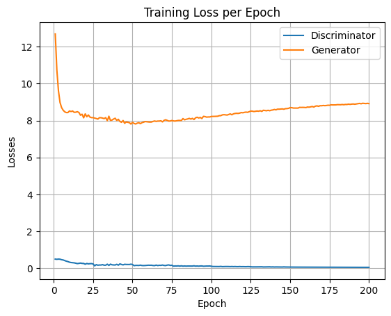
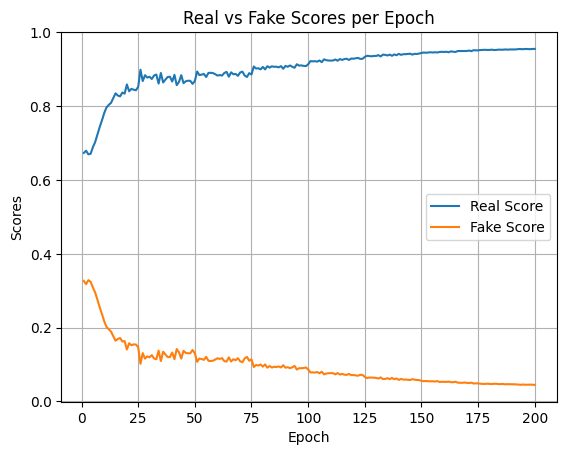

# StreetViewGAN: Translating Between Maps, Facades, and Real-World Images

This repository implements a **Pix2Pix-style Conditional GAN (cGAN)** to translate between maps, facades, and real-world street view images.  
It leverages paired datasets (e.g., the CMP Facades and Cityscapes datasets, as well as the Berkeley Maps dataset) to learn **image-to-image translation**.  
The project includes model training, visualization of outputs, loss tracking, and an interactive Gradio demo.

---

## Features
- **Pix2Pix GAN** for conditional image-to-image translation.  
- **Custom Dataset Loader** handling paired map/street-view images.  
- **Training Loop** with alternating generator/discriminator updates.  
- **Loss Monitoring** with per-epoch logs and plots.  
- **Image Sampling** at fixed intervals during training.  
- **Checkpointing** for model weights.  
- **Interactive Gradio Demo** to test trained models with uploaded images.  

---

## Repository Structure
```
StreetViewGAN-Translating-Between-Maps-Facades-and-Real-World-Images/
│── data/                  # Contains maps/facades dataset (downloaded automatically)
│── generated_images/       # Saved outputs during training
│── StreetViewGAN.ipynb     # Full training & evaluation notebook
│── G.pth                   # Trained generator weights
│── D.pth                   # Trained discriminator weights
│── README.md               # Project documentation
```

---

## Model Architectures

### Generator (U-Net Encoder-Decoder)
- Encoder progressively downsamples input images into feature maps.
- Decoder upsamples and concatenates skip connections to reconstruct translated images.
- Final activation: **Tanh**.

### Discriminator (PatchGAN)
- Receives input pairs (real street, generated/real map).  
- Classifies patches of the image as **real or fake**.  
- Produces a **score map** rather than a single scalar.

---

## Training Details
- Optimizer: **Adam** (`lr=2e-4`, betas=(0.5, 0.999))  
- Batch size: `1` (per Pix2Pix setup)  
- Epochs: `200`  
- Losses:  
  - **Generator Loss** = Adversarial Loss + λ·L1 Loss  
  - **Discriminator Loss** = Real/Fake BCE  
- λ (L1 weight): **100**  

---

## Results

Training logs show steadily improving generator quality:  
- **Discriminator loss** stabilizes ~0.05.  
- **Generator L1 reconstruction loss** decreases.  
- **Fake scores** approach realism (0.94+).  

Example outputs (maps ↔ streets) after various epochs:

| Epoch 1 | Epoch 50 | Epoch 100 | Epoch 200 |
|---------|----------|-----------|-----------|
|  |  |  |  |

---

## How to Run

### 1. Clone the repository
```bash
git clone https://github.com/Aman-Sunesh/StreetViewGAN-Translating-Between-Maps-Facades-and-Real-World-Images.git
cd StreetViewGAN-Translating-Between-Maps-Facades-and-Real-World-Images
```

### 2. Install dependencies
```bash
pip install -r requirements.txt
```

### 3. Download dataset
Dataset will be downloaded automatically when running the notebook.  

### 4. Train the model
```bash
jupyter notebook StreetViewGAN.ipynb
```

### 5. Launch Gradio demo
```bash
python -m StreetViewGAN.demo
```

---

## Gradio Demo
After training, run:
```python
iface.launch()
```
Open the local link and upload a street-view image to generate its **map/facade translation**.  

---

## Metrics
- **Generator Loss** vs. Epoch  
- **Discriminator Loss** vs. Epoch  
- **Real vs Fake Scores**  

(See training plots below)

  
  

---

## Future Work
- Extend translations to multiple modalities (satellite ↔ street ↔ sketch).  
- Use **CycleGAN** for unpaired datasets.  
- Deploy trained model as a **web app** with Flask/Gradio.  

---

## References
- Isola et al., ["Image-to-Image Translation with Conditional Adversarial Networks"](https://arxiv.org/abs/1611.07004), CVPR 2017.  
- CMP Facades Dataset.  
- Cityscapes Dataset.  
- Berkeley Pix2Pix Maps Dataset.  

---

## Author
**Aman Sunesh**  
[LinkedIn](https://www.linkedin.com/in/aman-sunesh/) | [GitHub](https://github.com/Aman-Sunesh)  

---
